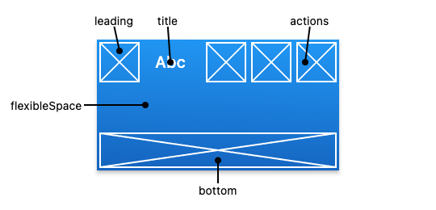

# Flutter

## GestureDetector widget
> https://blog.logrocket.com/handling-gestures-flutter-gesturedetector/

## The difference between Provider and Bloc
### Provider pattern
- ***ChangeNotifier***: ChangeNotifier can be understood as a class extended by other classes to provide notification if there is any change in the data of the class.
- ***ChangeNotifierProvider***: ChangeNotifierProvider can be understood as a parent widget holding the reference of ChangeNotifier, which is responsible for rendering within the UI the changes that happened in ViewModel class data.
- ***Consumer***: Consumer can be understood as a widget holding the reference of ViewModel Class that continually listens for any changes and rebuilds the child widget over which it has been wrapped.

### BLoC pattern (BLoC - Business Logic Component)
- It mean we've two classes
    - Contain all the UI components in the front end
    - The BLoC class which have all the business logic and data preparation
- The prerequisites for dealing with the Bloc pattern
    - Sinks and streams
    - RxDart
    - StreamBuilder
- The difference between the **StreamBuilder in Bloc** and **Consumer in Provider**
    - StreamBuilder listens to **the stream and fetches the model** on every change to rebuild the widget
    - Consumer listens as soon as **notifyListeners()** executes inside the provider class
> https://medium.com/swlh/the-differences-between-provider-pattern-and-bloc-pattern-fc93dc523672


## Cách thức hoạt động của Consumer
- Consumer sẽ dùng method builder thay vì chỉ là object child. Builder cần chính xác 3 tham số là BuildContext,  category data và sau đó là một Widget.‌‌
- Consumer là generic type vì vậy chúng ta phải chỉ định loại dữ liệu nào chúng ta muốn sử dụng. Trong trường hợp của này, ta đang sử dụng dữ liệu từ CategoryProvider do đó chúng mình sẽ viết Consumer<CategoryProvider>(...).‌‌
- Bạn có thể so sánh điều này với Provider.of<...>(context) vì cả hai đều thiết lập active listener đối với provider và kích hoạt hàm build khi dữ liệu thay đổi.‌‌
Builder sẽ nhận BuildContext mà chúng ta cung cấp bằng cách sử dụng context có sẵn bên trong widget của chúng ta.‌‌
- Nó cũng nhận được instance dữ liệu. Giống như trong trường hợp trên, chúng ta nhận được snapshot dữ liệu mới nhất từ ​​CategoryProvider có tên biến là categoryData.‌‌

## The difference between stateFul widget and stateLess widget
| stateLessWidget | stateFulWidget |
| :-- | :-- |
| Stateless Widgets are static widgets. | Stateful Widgets are dynamic widgets.|
| They do not depend on any data change or any behavior change. | They can be updated during runtime based on user action or data change.|
| Stateless Widgets do not have a state, they will be rendered once and will not update themselves, but will only be updated when external data changes. | Stateful Widgets have an internal state and can re-render if the input data changes or if Widget’s state changes. |
| For Example: Text, Icon, RaisedButton are Stateless Widgets.  | For Example: Checkbox, Radio Button, Slider are Stateful Widgets |

## AppBar 
- Thanh menu được hiện thị trên cùng gồm các thanh công cụ và các tiện ích khác

<br />



### Properties
#### actions
- A list of Widgets to display in a row after the title widget.
#### title
- The primary widget displayed in the app bar.

<br />

```dart
AppBar(
    title: Text(widget.title),
    actions: <Widget>[
        IconButton(
            icon: const Icon(Icons.more_vert),
            tooltip: 'More',
            onPressed: () {
                // handle the press
            },
        ),
    ],
)
```
## Container
- The same ***div*** in HTML
### Properties
#### alignment
- Align the child within the container. 
#### child
- The child contained by the container.
#### decoration
- The decoration to paint behind the child
#### foreDecoration
- The decoration to paint in font of the child